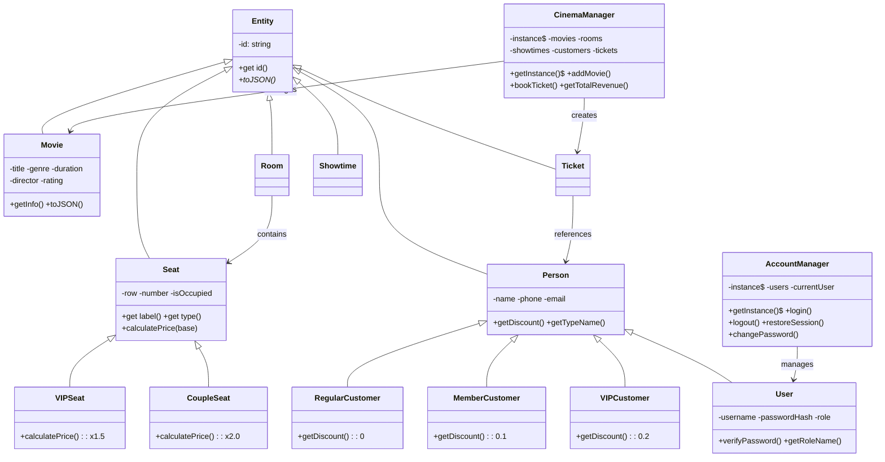

<](https://developer.mozilla.org/en-US/docs/Web/JavaScript)
[](https://developer.mozilla.org/en-US/docs/Web/HTML)
[](https://developer.mozilla.org/en-US/docs/Web/CSS)
[](.)
[](.)

*Hệ thống quản lý rạp chiếu phim mini xây dựng bằng Vanilla JavaScript, áp dụng đầy đủ 4 trụ cột OOP cùng các Design Pattern quan trọng.*

</div>

---

## 📑 Mục Lục

- [Tổng Quan](#-tổng-quan)
- [Tính Năng](#-tính-năng)
- [Công Nghệ](#-công-nghệ)
- [Cài Đặt & Chạy](#-cài-đặt--chạy)
- [Tài Khoản Mặc Định](#-tài-khoản-mặc-định)
- [Kiến Trúc Hệ Thống](#-kiến-trúc-hệ-thống)
- [Phân Tích OOP](#-phân-tích-oop)
- [Design Patterns](#-design-patterns)
- [Sơ Đồ Lớp](#-sơ-đồ-lớp)
- [Ánh Xạ OOP → Mã Nguồn](#-ánh-xạ-oop--mã-nguồn)

---

## 🎯 Tổng Quan

**CineMax** là hệ thống quản lý rạp chiếu phim mini hoàn chỉnh, bao gồm:
- 🔐 Đăng nhập với phân quyền (Admin / Staff / Manager)
- 🎥 Quản lý phim, lịch chiếu, phòng chiếu
- 🎫 Đặt vé với sơ đồ ghế tương tác
- 💰 Báo cáo doanh thu trực quan
- 👥 Quản lý khách hàng với hệ thống giảm giá tự động

Dự án được xây dựng **100% bằng Vanilla JavaScript** (không framework), tập trung minh họa các khái niệm **Lập Trình Hướng Đối Tượng**.

---

## ✨ Tính Năng

| # | Tính năng | Mô tả |
|:-:|-----------|-------|
| 1 | **🔐 Đăng nhập / Xác thực** | Trang login premium, 3 vai trò, session management, đăng xuất |
| 2 | **🎥 Quản lý phim** | CRUD phim + tự động đề xuất tạo lịch chiếu khi thêm phim mới |
| 3 | **🏛️ Quản lý phòng chiếu** | 3 phòng (Standard, Premium, IMAX), xem sơ đồ ghế chi tiết |
| 4 | **🕐 Quản lý lịch chiếu** | Gán phim vào phòng với ngày/giờ cụ thể |
| 5 | **🎫 Đặt vé** | Chọn lịch chiếu → Chọn ghế → Nhập thông tin → Xuất vé |
| 6 | **👥 Quản lý khách hàng** | 3 cấp: Regular (0%), Member (-10%), VIP (-20%) |
| 7 | **💰 Báo cáo doanh thu** | Thống kê theo phim, biểu đồ cột, lịch sử giao dịch |
| 8 | **🔍 Tìm kiếm đa danh mục** | Tìm Phim / Khách hàng / Vé / Lịch chiếu |
| 9 | **🔔 Hệ thống thông báo** | Thông báo realtime, lưu trữ localStorage |
| 10 | **🔑 Quản lý tài khoản** | Xem profile, đổi mật khẩu, danh sách tài khoản (Admin) |

---

## 🛠 Công Nghệ

| Thành phần | Công nghệ |
|-----------|-----------|
| **Ngôn ngữ** | JavaScript ES2022+ (Private Fields `#`) |
| **Giao diện** | HTML5 + CSS3 (Glassmorphism, Dark Mode) |
| **Font** | Google Fonts (Inter, Outfit) |
| **Lưu trữ** | localStorage API |
| **Kiến trúc** | MVC Pattern |
| **Thiết kế** | Responsive, Mobile-friendly |

---

## 🚀 Cài Đặt & Chạy

### Cách 1: Mở trực tiếp
```bash
# Clone hoặc tải project
# Mở file index.html bằng trình duyệt
```

### Cách 2: Dùng Live Server (khuyến nghị)
```bash
# Cài extension "Live Server" trong VS Code
# Click chuột phải vào index.html → "Open with Live Server"
```

### Cấu trúc thư mục
```
cinema-management/
├── index.html          # Giao diện chính (View)
├── styles.css          # Thiết kế giao diện
├── models.js           # Tầng Model - các lớp OOP
├── app.js              # Tầng Controller - xử lý logic
└── README.md           # Tài liệu dự án
```

---

## 🔑 Tài Khoản Mặc Định

| Vai trò | Username | Password | Quyền hạn |
|---------|----------|----------|-----------|
| 🟣 **Quản trị viên** | `admin` | `admin123` | Toàn quyền + xem danh sách tài khoản |
| 🟢 **Nhân viên** | `staff` | `staff123` | Quản lý phim, đặt vé, xem doanh thu |
| 🟠 **Quản lý** | `manager` | `manager123` | Quản lý phim, đặt vé, xem doanh thu |

> 💡 Bấm vào chip tài khoản trên trang đăng nhập để tự động điền thông tin.

---

## 🏗 Kiến Trúc Hệ Thống

```
┌─────────────────────────────────────────┐
│              TẦNG VIEW (UI)             │
│         index.html + styles.css         │
│  Login, Dashboard, Movies, Showtimes,   │
│  Booking, Rooms, Customers, Revenue,    │
│  Accounts                               │
├─────────────────────────────────────────┤
│          TẦNG CONTROLLER                │
│              app.js                     │
│  Auth Flow, Navigation, Search,         │
│  Notification System, Room Detail,      │
│  Account Management                     │
├─────────────────────────────────────────┤
│           TẦNG MODEL (OOP)              │
│             models.js                   │
│  Entity, Movie, Seat, VIPSeat,          │
│  CoupleSeat, Room, Showtime, Person,    │
│  RegularCustomer, MemberCustomer,       │
│  VIPCustomer, User, Ticket,             │
│  SeatFactory, CustomerFactory,          │
│  CinemaManager, AccountManager          │
├─────────────────────────────────────────┤
│          TẦNG PERSISTENCE               │
│     localStorage API (movies,           │
│     showtimes, customers, tickets,      │
│     notifications, users, session)      │
└─────────────────────────────────────────┘
```

---

## 📚 Phân Tích OOP

### 1️⃣ Encapsulation (Đóng gói)

> Ẩn dữ liệu bên trong đối tượng, chỉ truy cập qua getter/setter có validation.

```javascript
class Movie extends Entity {
  #title; #genre; #duration; #rating;  // Private fields

  get title() { return this.#title; }
  set title(v) {
    if (!v) throw new Error("Tên phim không được rỗng");
    this.#title = v;
  }
  set rating(v) {
    this.#rating = Math.min(10, Math.max(0, v));  // Auto-clamp [0, 10]
  }
}
```

✅ **Tất cả 13 lớp** sử dụng private fields `#` + getter/setter.

---

### 2️⃣ Inheritance (Kế thừa)

> Lớp con thừa hưởng từ lớp cha, có thể mở rộng hoặc ghi đè.

**Nhánh Seat:**
```
Entity → Seat → VIPSeat (giá x1.5)
                CoupleSeat (giá x2.0)
```

**Nhánh Person:**
```
Entity → Person → RegularCustomer (giảm 0%)
                  MemberCustomer (giảm 10%)
                  VIPCustomer (giảm 20%)
                  User (tài khoản hệ thống)
```

---

### 3️⃣ Polymorphism (Đa hình)

> Cùng phương thức, khác kết quả tùy đối tượng thực tế.

```javascript
// CÙNG calculatePrice(), KHÁC kết quả:
new Seat().calculatePrice(100000)        // → 100.000₫
new VIPSeat().calculatePrice(100000)     // → 150.000₫
new CoupleSeat().calculatePrice(100000)  // → 200.000₫

// CÙNG getDiscount(), KHÁC tỷ lệ:
new RegularCustomer().getDiscount()  // → 0
new MemberCustomer().getDiscount()   // → 0.1
new VIPCustomer().getDiscount()      // → 0.2
```

> 🔥 **Polymorphism kép** trong `bookTicket()`: kết quả tính tiền tự động thay đổi dựa trên **loại ghế** VÀ **loại khách hàng**.

---

### 4️⃣ Abstraction (Trừu tượng)

> Ẩn chi tiết triển khai, chỉ cung cấp giao diện cần thiết.

```javascript
class Entity {
  toJSON() {
    throw new Error("Lớp con phải override toJSON()");
    // → "Abstract method": bắt buộc lớp con cài đặt
  }
}
```

---

## 🧩 Design Patterns

### Singleton Pattern

Đảm bảo chỉ có **1 instance** duy nhất trong toàn bộ ứng dụng.

Áp dụng cho: **`CinemaManager`** và **`AccountManager`**

```javascript
class CinemaManager {
  static #instance = null;
  constructor() {
    if (CinemaManager.#instance) return CinemaManager.#instance;
    CinemaManager.#instance = this;
  }
  static getInstance() { /* ... */ }
}
// CinemaManager.getInstance() === CinemaManager.getInstance() → true
```

### Factory Pattern

Tạo đối tượng **không cần biết lớp cụ thể**, chỉ truyền "loại".

Áp dụng cho: **`SeatFactory`** và **`CustomerFactory`**

```javascript
SeatFactory.create("vip", {row:'E', number:5})     // → VIPSeat
SeatFactory.create("couple", {row:'H', number:1})   // → CoupleSeat
CustomerFactory.create("member", {name:'Bình'})      // → MemberCustomer
```

---

## 📊 Sơ Đồ Lớp



---

## 🗺 Ánh Xạ OOP → Mã Nguồn

| Khái niệm | Code | Lớp |
|-----------|------|-----|
| **Private Field** | `#title`, `#passwordHash` | Tất cả 13 lớp |
| **Getter/Setter** | `get title()`, `set rating(v)` | Movie, Seat, Person, User |
| **Kế thừa** | `extends Seat`, `extends Person` | VIPSeat, CoupleSeat, User, các Customer |
| **Đa hình** | `calculatePrice()`, `getDiscount()` | Seat hierarchy, Person hierarchy |
| **Trừu tượng** | `Entity.toJSON()` throws Error | Entity (abstract base) |
| **Singleton** | `static #instance`, `getInstance()` | CinemaManager, AccountManager |
| **Factory** | `SeatFactory.create()` | SeatFactory, CustomerFactory |
| **Exception** | `try/catch`, `throw new Error()` | bookTicket(), login() |
| **Authentication** | `login()`, `verifyPassword()` | AccountManager, User |
| **Persistence** | `localStorage`, `#saveData()` | CinemaManager, AccountManager |

---

## 📋 Tổng Kết

| # | Khái niệm | Trạng thái |
|:-:|-----------|:----------:|
| 1 | Encapsulation | ✅ |
| 2 | Inheritance | ✅ |
| 3 | Polymorphism | ✅ |
| 4 | Abstraction | ✅ |
| 5 | Singleton Pattern | ✅ |
| 6 | Factory Pattern | ✅ |
| 7 | Exception Handling | ✅ |
| 8 | Authentication & Authorization | ✅ |
| 9 | Data Persistence | ✅ |
| 10 | MVC Architecture | ✅ |
| 11 | Tìm kiếm đa danh mục | ✅ |
| 12 | Notification System | ✅ |
| 13 | Interactive UI | ✅ |
| 14 | Role-based Access | ✅ |

---

<div align="center">

**© 2026 CineMax Cinema Management System — Đồ án Lập Trình Hướng Đối Tượng**

</div>
]]>
